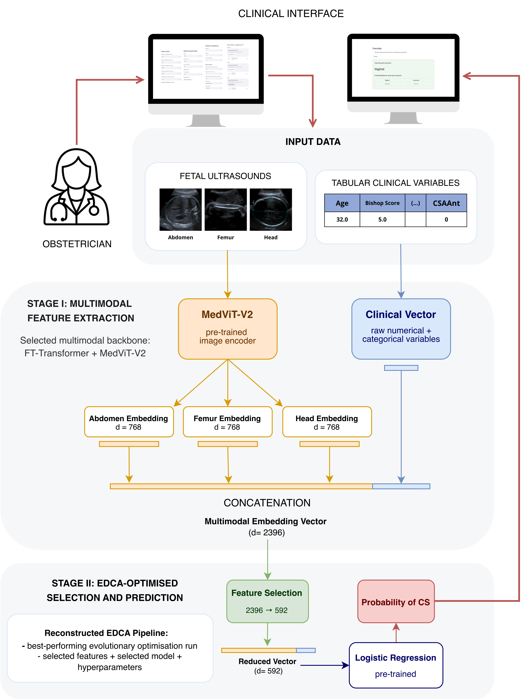

# Final Model

This folder contains the code to run the final multimodal architecture for mode of delivery prediction.

## Scripts

- `*final_model*`: Calls the multimodal model, extracts and concatenates embeddings into a final multimodal vector, reconstructs the best pipeline found with EDCA, applies feature selection, and outputs predictions.

- `*evaluate_model*`: Evaluates the final model on the full prospective dataset.


## Setup

To use the final model obtained in this project run the following code: 

```
conda env create -f medvit2_full.yml
conda activate medvit2_full
python evaluate_model.py
```

Before that you should ensure the following:
- MedViT-V2 repository inside `*multimodal_architecture/*` .
- Download the model weights from [weights](https://drive.google.com/drive/folders/1_MAX3CrnvtrBHTU_izK3f_6LHKpMugcv) and place them in `*multimodal_architecture/models_prospective/MedViT2_nopt/*`.
- `data.py`, `columns_config.json`, `models.py` are present in `*multimodal_architecture/*`.


## Architecture Overview

The diagram below illustrates the proposed multimodal architecture workflow:

 